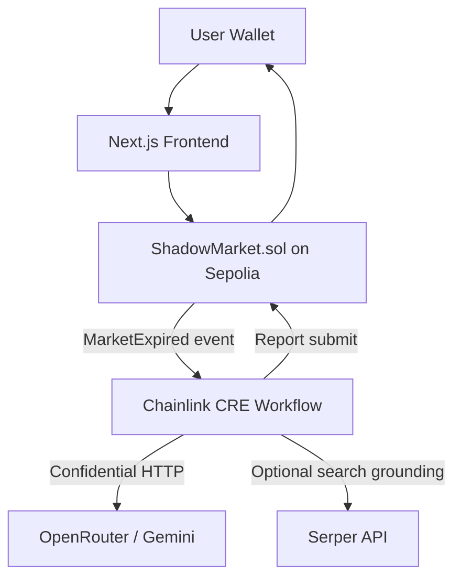

# ShadowMarket

Private prediction markets with sealed-bid privacy, commit-reveal integrity, and CRE-driven AI settlement.

---

## Table of Contents

- [What is ShadowMarket?](#what-is-shadowmarket)
- [Core Features](#core-features)
- [System Architecture](#system-architecture)
- [Repository Layout](#repository-layout)
- [How the Market Lifecycle Works](#how-the-market-lifecycle-works)
- [Smart Contract Reference](#smart-contract-reference)
- [Prerequisites](#prerequisites)
- [Installation](#installation)
- [Environment Variables](#environment-variables)
- [Quick Start (Local Dev)](#quick-start-local-dev)
- [Deployment Guide (Sepolia)](#deployment-guide-sepolia)
- [Script Reference](#script-reference)
- [CRE Workflow Notes](#cre-workflow-notes)
- [Frontend Notes](#frontend-notes)
- [Deployed Addresses](#deployed-addresses)
- [Chainlink Usage](#chainlink-usage)
- [Troubleshooting](#troubleshooting)
- [Security Notes](#security-notes)
- [License](#license)

---

## What is ShadowMarket?

ShadowMarket is a prediction market protocol where users commit hidden positions first and reveal later.

This design prevents pre-expiry information leakage and front-running by splitting bidding into two phases:

1. **Commit**: user submits hash of `(amount, side, salt)`.
2. **Reveal**: user reveals the clear values after the market transitions to `RESOLVING`.

Market outcomes are then settled by an authorized settler (owner or CRE DON receiver path), and winners claim a proportional payout from the total pool minus protocol fee.

---

## Core Features

- **Commit-reveal bidding**: private bid intent before reveal phase.
- **USDC-denominated pools**: contract uses Sepolia USDC address constant in production contract.
- **Deterministic payout math**: winners share `distributablePool = totalPool - fee` pro-rata.
- **CRE-compatible receiver interface**: `onReport(bytes report, bytes signature)` for signed report delivery.
- **Owner/authorized settler controls**: create markets, transition status, settle, withdraw fees.

---

## System Architecture



### Data Flow Summary

1. Owner creates market with expiry.
2. Users submit sealed bid commitments.
3. Owner transitions market to `RESOLVING` (emits `MarketExpired`).
4. Users reveal amount/side/salt and transfer USDC into pool.
5. Settler resolves outcome (`settleMarket` or `onReport`).
6. Winners call `claimWinnings`.

---

## Repository Layout

```text
.
├─ contracts/
│  ├─ ShadowMarket.sol         # production contract (fixed Sepolia USDC constant)
│  ├─ ShadowMarketTest.sol     # test contract (injectable USDC)
│  ├─ MockUSDC.sol             # local/test token
│  └─ IReceiver.sol            # CRE report receiver interface
├─ test/
│  └─ ShadowMarket.test.ts     # unit/integration tests for core lifecycle
├─ scripts/
│  ├─ deploy.ts                # Sepolia deployment + sample markets + env updates
│  ├─ check-env.ts             # env validation checks
│  ├─ interact.ts              # generic CLI interactions
│  ├─ demo-setup.ts            # create demo market + optional mint to demo wallets
│  ├─ manual-settle.ts         # manual settlement helper
│  └─ e2e-test.ts              # lifecycle E2E on Hardhat
├─ cre-workflow/
│  ├─ workflow.yaml            # CRE trigger/capability definition
│  └─ src/                     # settlement logic, simulation, tests
├─ frontend/
│  ├─ app/                     # Next.js routes
│  ├─ components/
│  └─ lib/                     # ABIs, hooks, crypto helpers
└─ deployments/
   └─ sepolia.json             # latest deployment metadata
```

---

## How the Market Lifecycle Works

### 1) Create Market

- `owner` calls `createMarket(question, expiryTimestamp)`.
- Market starts in `OPEN` status.

### 2) Commit Phase (OPEN)

- User computes commitment hash:

```solidity
keccak256(abi.encode(amount, side, salt))
```

- User submits `submitSealedBid(marketId, commitmentHash)`.

### 3) Transition to Resolving

- `owner` calls `setResolvingStatus(marketId)`.
- Emits `MarketExpired(marketId, question, expiry)`.

### 4) Reveal Phase (RESOLVING)

- User calls `revealBid(marketId, amount, side, salt)`.
- Contract checks hash match and transfers USDC from user to pool.

### 5) Settlement

- Authorized entity calls `settleMarket(...)` or CRE calls `onReport(...)`.
- Market moves to `SETTLED` with outcome and rationale.

### 6) Claim

- Winning users call `claimWinnings(marketId)`.
- Contract applies fee and pays proportional share.

---

## Smart Contract Reference

### Main Contract

- `contracts/ShadowMarket.sol`

### Status Enum

- `OPEN = 0`
- `RESOLVING = 1`
- `SETTLED = 2`

### Key Methods

- `createMarket(string question, uint256 expiryTimestamp)`
- `submitSealedBid(uint256 marketId, bytes32 commitmentHash)`
- `setResolvingStatus(uint256 marketId)`
- `revealBid(uint256 marketId, uint256 amount, bool side, bytes32 salt)`
- `settleMarket(uint256 marketId, bool outcome, string rationale)`
- `onReport(bytes report, bytes signature)`
- `claimWinnings(uint256 marketId)`

### Payout Formula

Given:

- `winningPool`
- `losingPool`
- `totalPool = winningPool + losingPool`
- `fee = totalPool * 200 / 10000` (2%)
- `distributable = totalPool - fee`

Then each winner receives:

$$
payout = \frac{bidAmount \cdot distributable}{winningPool}
$$

---

## Prerequisites

- Node.js `>= 20`
- npm `>= 8`
- Sepolia RPC provider URL
- Wallet private key funded with Sepolia ETH

---

## Installation

```bash
git clone <your-fork-or-this-repo-url>
cd ShadowMarket-main
npm install
```

Optional full bootstrap (root + subprojects + compile/build):

```bash
npm run bootstrap
```

---

## Environment Variables

There is currently no committed `.env.example`, so create `.env` manually at repo root.

### Root `.env` (required for deployment/scripts)

```bash
PRIVATE_KEY=0x...
SEPOLIA_RPC_URL=https://...
ETHERSCAN_API_KEY=...

# Used by script checks and/or workflow integration docs
GEMINI_API_KEY=...
CHAINLINK_CRE_DON_ID=...
CRE_DON_ADDRESS=0x...

# Needed by interact/manual scripts
SHADOWMARKET_CONTRACT_ADDRESS=0x...

# Optional for demo setup minting
DEMO_WALLET_1=0x...
DEMO_WALLET_2=0x...
```

### `frontend/.env.local`

```bash
NEXT_PUBLIC_SHADOWMARKET_ADDRESS=0x...
NEXT_PUBLIC_CHAIN_ID=11155111
NEXT_PUBLIC_SEPOLIA_RPC=https://rpc.sepolia.org
NEXT_PUBLIC_REPO_URL=https://github.com/<you>/<repo>
```

### `cre-workflow/.env`

```bash
SHADOWMARKET_CONTRACT_ADDRESS=0x...
SEPOLIA_RPC_URL=https://...
CRE_SIGNING_KEY=0x...

# Depending on flow variant in use:
OPENROUTER_API_KEY=...
SERPER_API_KEY=...
GEMINI_API_KEY=...
```

Validate root environment:

```bash
npm run check-env
```

---

## Quick Start (Local Dev)

### 1) Compile and run contract tests

```bash
npx hardhat compile
npx hardhat test
```

### 2) Run lifecycle E2E against local Hardhat network

```bash
npx hardhat run scripts/e2e-test.ts
```

### 3) Start frontend

```bash
cd frontend
npm install
npm run dev
```

Frontend default URL:

- `http://localhost:3000`

---

## Deployment Guide (Sepolia)

Deploy contracts and seed markets:

```bash
npm run deploy:sepolia
```

`scripts/deploy.ts` performs:

1. Deploy `MockUSDC` on non-mainnet.
2. Deploy `ShadowMarket`.
3. Set `authorizedSettler` if `CRE_DON_ADDRESS` is set.
4. Attempt to create three sample markets (skips if expiry already past).
5. Write deployment file to `deployments/sepolia.json`.
6. Update `cre-workflow/.env` and `frontend/.env.local` with contract address.

Verify contract (if desired):

```bash
npx hardhat verify --network sepolia <SHADOWMARKET_ADDRESS>
```

---

## Script Reference

### Root Scripts (`package.json`)

- `npm run deploy:sepolia` — deploys contracts to Sepolia.
- `npm run test:all` — Hardhat tests + CRE workflow tests.
- `npm run bootstrap` — installs dependencies and builds subprojects.
- `npm run demo:setup` — creates a demo market and optional demo mints.
- `npm run demo:settle` — helper for manual settlement.
- `npm run check-env` — validates key env variables and connectivity.

### Direct CLI Helpers (`scripts/interact.ts`)

```bash
npx ts-node scripts/interact.ts --command create-market --question "Will X happen?" --expiry <unix_ts>
npx ts-node scripts/interact.ts --command submit-bid --market-id 1 --commitment 0x...
npx ts-node scripts/interact.ts --command reveal-bid --market-id 1 --amount 100 --side yes --salt 0x...
npx ts-node scripts/interact.ts --command settle-market --market-id 1 --outcome yes --rationale "..."
npx ts-node scripts/interact.ts --command claim --market-id 1
```

### Manual settle helper

```bash
npx ts-node scripts/manual-settle.ts --market-id 1 --outcome yes --rationale "optional rationale"
```

---

## CRE Workflow Notes

The repo contains CRE workflow assets in `cre-workflow/`:

- `workflow.yaml` defines `evm_log` trigger for `MarketExpired(uint256,string,uint256)`.
- Capabilities include confidential HTTP, EVM read, and EVM write.
- Settlement logic lives in `src/settlement.ts` and `src/workflow.ts`.

### Run workflow unit tests

```bash
cd cre-workflow
npm install
npm test
```

### Build workflow package

```bash
cd cre-workflow
npm run build
```

### Important implementation status

Current `cre-workflow/src` files include multiple settlement/runtime variants and may require reconciliation before production deployment to a DON. Treat this folder as an active integration workspace, not yet final production wiring.

---

## Frontend Notes

- Next.js app is in `frontend/`.
- Reusable contract hooks and crypto helpers are present in `frontend/lib/` for real wallet interactions.

### Frontend commands

```bash
cd frontend
npm install
npm run dev
npm run build
npm run start
```

---

## Deployed Addresses

From `deployments/sepolia.json`:

- Network: `sepolia`
- ShadowMarket: `0x3881DFC77ABFc85b4aDe32D998FA2fd2229F7290`
- MockUSDC: `0xF56d05d89f0373b7414D8a6FdBB6f293e7dBDeE7`
- Deployer: `0x9f2EdCE3a34e42eaf8f965d4E14aDDd12Cf865f4`
- Timestamp: `2026-03-01T00:18:13.056Z`

Contract constant in production `ShadowMarket.sol`:

- Sepolia USDC: `0x1c7D4B196Cb0C7B01d743Fbc6116a902379C7238`

---

## Chainlink Usage

ShadowMarket actively uses the **Chainlink Confidential Runtime Environment (CRE)** to trustlessly resolve prediction market outcomes via AI consensus. 

When a market expires, the contract emits a `MarketExpired` event, which triggers the off-chain Chainlink CRE workflow. This workflow uses confidential HTTP capabilities to perform search grounding (fetching real-world data like historical crypto prices via the Serper API) and passes this context to dual LLM models (Gemini Flash & Claude via OpenRouter) to determine the outcome. Once consensus is reached, the CRE encodes a payload and securely writes the settlement report back on-chain.

You can view the specific Chainlink CRE implementation logic here:
- **CRE Workflow Definition**: [workflow.yaml](https://github.com/PredictLink/ShadowMarket/blob/main/cre-workflow/workflow.yaml)
- **EVM Trigger & Execution**: [cre-workflow/src/workflow.ts](https://github.com/PredictLink/ShadowMarket/blob/main/cre-workflow/src/workflow.ts)
- **AI Outcome Consensus Logic**: [cre-workflow/src/settlement.ts](https://github.com/PredictLink/ShadowMarket/blob/main/cre-workflow/src/settlement.ts)

---

## Security Notes

- Never commit private keys or API keys.
- Use dedicated deployment wallets for testnet/prod.
- Review and test settle authorization paths before mainnet usage.
- Consider adding report-signature verification in `onReport` for stronger trust minimization.

---


## License

MIT
